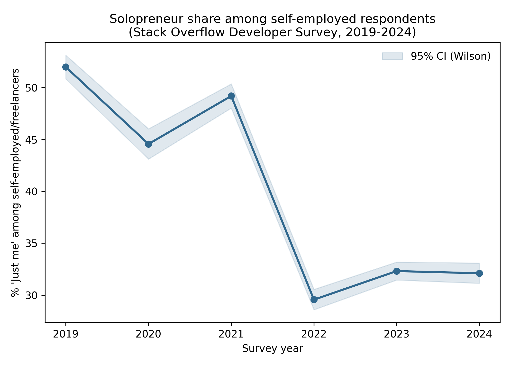

# Results

## Sample Description

Two data sources, analyzed at their respective native levels of aggregation
rather than pooled, provide the basis for the results reported below. The
macro-level sample comprises annual World Bank observations for 213
countries between 2005 and 2024 (*N* = 4,119 country-years with non-missing
values for both the self-employment and internet-penetration indicators in
a given year); regional and income-group aggregates (e.g., "High income")
were excluded from this count.

The individual-level sample is drawn from six independent annual waves
(2019–2024) of the Stack Overflow Developer Survey, restricted to
respondents who identified as self-employed or freelance and reported a
determinate organization size (*N* = 47,322; 82.1% of the self-employed/
freelance respondent pool across these waves — the remaining 17.9% answered
"I don't know" or left organization size unspecified and were excluded
rather than imputed as non-solopreneurs). Annual sample sizes ranged from
4,482 (2020) to 11,247 (2023). Respondents reported a mean professional
coding experience of 12.72 years (*SD* = 9.62; 4.4% missing), and the five
most-represented countries were the United States, Germany, India, Poland,
and the United Kingdom. Across the full 2019–2024 pool, 38.5% of respondents
met the structural criterion for solopreneur status (zero employees,
operationalized as "Just me" on the organization-size item).

## Internet Penetration and Aggregate Self-Employment

To situate the individual-level analyses that follow within a broader
macroeconomic context, the association between internet penetration and
self-employment was first examined at the country-year level.

A two-way fixed-effects panel regression was estimated, with country and
year fixed effects and standard errors clustered by country, to test
whether within-country changes in internet penetration were associated
with the total self-employment rate:

$$
\text{SelfEmployed}_{it} = \alpha_i + \gamma_t + \beta \cdot \text{InternetUsers}_{it} + \varepsilon_{it}
$$

**Table 1**
*Panel Fixed-Effects Regression of Self-Employment Rate on Internet Penetration*

| Predictor | *b* | *SE* | 95% CI | *p* |
|---|---|---|---|---|
| Internet users (% of population) | −0.028 | 0.012 | [−0.051, −0.004] | .020 |

*Note.* Country and year fixed effects included; standard errors clustered
by country. *N* = 4,119 country-years, 213 countries. *R*²(within) = .173.

Internet penetration was a statistically significant predictor of the
self-employment rate, *b* = −0.028, 95% CI [−0.051, −0.004], *p* = .020,
and the model accounted for a moderate share of within-country variance,
*R*²(within) = .173, despite the small per-unit coefficient. The direction
of the association was negative: within a given country,
periods of higher internet penetration were associated with a slightly
lower aggregate self-employment rate. A descriptive robustness check using
Eurostat data on own-account workers (thousands of persons, EU/EEA
countries, 2010–2024) showed a decline from 64,166.5 thousand in 2019 to
57,100.9 thousand in 2021, coinciding with the COVID-19 period, followed by
partial recovery to 60,020.9 thousand by 2024 (Table S1).

## Temporal Trend in Solopreneur Share Among the Self-Employed

Having established that the aggregate self-employment rate showed only a
weak association with internet penetration at the macro level, the
analysis proceeded to the individual level to examine whether the
composition of the self-employed/freelance population itself had shifted
over time — specifically, the share reporting zero employees.

A logistic regression was fit with survey year (mean-centered) as a
continuous predictor of solopreneur status (organization size = "Just
me") among self-employed/freelance respondents:

$$
\text{logit}\big(P(\text{Solopreneur}_i = 1)\big) = \beta_0 + \beta_1 \cdot \text{Year}_{c,i}
$$

**Table 2**
*Proportion of Solopreneurs ("Just Me") Among Self-Employed/Freelance Respondents, by Year*

| Year | *n* | *n* solopreneurs | Proportion | 95% CI (Wilson) |
|---|---|---|---|---|
| 2019 | 7,344 | 3,817 | .520 | [.508, .531] |
| 2020 | 4,482 | 1,997 | .446 | [.431, .460] |
| 2021 | 7,088 | 3,486 | .492 | [.480, .503] |
| 2022 | 8,323 | 2,460 | .296 | [.286, .305] |
| 2023 | 11,247 | 3,634 | .323 | [.315, .332] |
| 2024 | 8,838 | 2,837 | .321 | [.311, .331] |

**Table 3**
*Logistic Regression of Solopreneur Status on Survey Year*

| Model | *OR* per year | 95% CI | *p* |
|---|---|---|---|
| Unadjusted | 0.827 | [0.818, 0.836] | < .001 |
| Country-adjusted (robustness) | 0.829 | [0.820, 0.839] | < .001 |

*Note.* *N* = 47,322 for both models. Country-adjusted model includes the
20 most-represented countries as dummy-coded covariates plus an "Other"
category. McFadden *R*² = .018 (unadjusted model).

The odds of solopreneur status decreased by a factor of 0.827 per survey
year, 95% CI [0.818, 0.836], *p* < .001, corresponding to the marked
decline visible in Table 2 — from 52.0% of the self-employed/freelance
pool in 2019 to 32.1% in 2024, with the steepest single-year drop occurring
between 2021 (49.2%) and 2022 (29.6%). This effect was materially unchanged
after adjusting for the 20 most-represented countries, *OR* = 0.829, 95% CI
[0.820, 0.839], *p* < .001, indicating that the decline was not attributable
to year-to-year shifts in the countries represented in the sample. The
McFadden pseudo-*R*² for the unadjusted model was low (.018), indicating
that survey year alone accounted for a small share of individual-level
variance in solopreneur status, consistent with substantial unobserved
heterogeneity among respondents beyond year of response.

## Income Differences Between Solopreneurs and Other Self-Employed/Freelance Respondents

Having documented a shift in the relative size of the solopreneur
subgroup, the analysis turned to whether this subgroup differed from other
self-employed/freelance respondents in reported income, controlling for
professional experience, country, and survey year.

Prior to modeling, the missing-data mechanism for annual income was
diagnosed. Missingness was associated with organization size — 48.3% among
solopreneurs versus 32.0% among respondents with larger organization
sizes, decreasing monotonically with team size — indicating a Missing At
Random (MAR) rather than Missing Completely At Random mechanism. Values
outside a plausible range for developer annual income (< $1,000 or >
$2,000,000 USD; *n* = 682, 1.4%) and additional log-scale outliers (|*z*| >
3.29; *n* = 100) were recoded as missing prior to imputation rather than
deleted or winsorized, yielding a combined missingness rate of 40.0% on
log-transformed income. Multicollinearity among the model's predictors was
checked prior to fitting (variance inflation factor, VIF): the two
substantive predictors showed no meaningful collinearity (solopreneur
status, VIF = 1.10; years of experience, VIF = 1.11), while two of the
dummy-coded country covariates exceeded the conventional VIF = 5 threshold
(the residual "Other" category, VIF = 10.42, and United States, VIF =
6.21) — an expected artifact of dummy-coding a covariate with one dominant
category and a large residual bucket, not a threat to the interpretation
of the solopreneur coefficient. Given the MAR mechanism, Multiple
Imputation by Chained Equations (40 imputations, per Graham et al.'s
[2007] simulation-based guidance for 50% missing information, the
conservative benchmark closest to the 40.0% observed here) was used, with
parameter estimates pooled using Rubin's rules, rather than single
imputation or listwise deletion:

$$
\log(\text{Income}_i) = \beta_0 + \beta_1 \cdot \text{Solopreneur}_i + \beta_2 \cdot \text{YearsExperience}_i + \sum_k \gamma_k \text{Country}_{k,i} + \sum_t \delta_t \text{Year}_{t,i} + \varepsilon_i
$$

**Table 4**
*Multiply Imputed and Complete-Case Estimates of the Solopreneur Income Gap*

| Model | *b* (log income) | *SE* | 95% CI | *p* | Income difference | *n* |
|---|---|---|---|---|---|---|
| MICE (pooled, primary) | −0.235 | 0.012 | [−0.258, −0.212] | < .001 | −20.9% | 47,322 |
| Complete-case (sensitivity) | −0.220 | 0.012 | [−0.245, −0.196] | < .001 | −19.8% | 27,765 |

*Note.* Both models control for years of professional experience, the 20
most-represented countries (dummy-coded, plus "Other"), and survey year.
Income difference calculated as (*e*^*b*^ − 1) × 100.

Solopreneurs reported significantly lower income than other self-employed/
freelance respondents with comparable experience, country, and survey
year, *b* = −0.235, 95% CI [−0.258, −0.212], *p* < .001, corresponding to
an income approximately 20.9% lower on the original scale. The
complete-case estimate obtained without addressing the MAR mechanism was
similar in direction and magnitude, *b* = −0.220, 95% CI [−0.245, −0.196],
*p* < .001 (a 19.8% difference), indicating that in this instance the
point estimate was not substantially altered by the missing-data treatment,
although the multiply imputed estimate is reported as the primary result
on methodological grounds.

---

*Note on classification.* All three findings reported above were derived
through exploratory analysis of secondary data rather than from
pre-registered, a priori hypotheses, and are reported here as
hypothesis-generating results requiring independent replication, following
standard practice for post hoc analyses of observational data.
